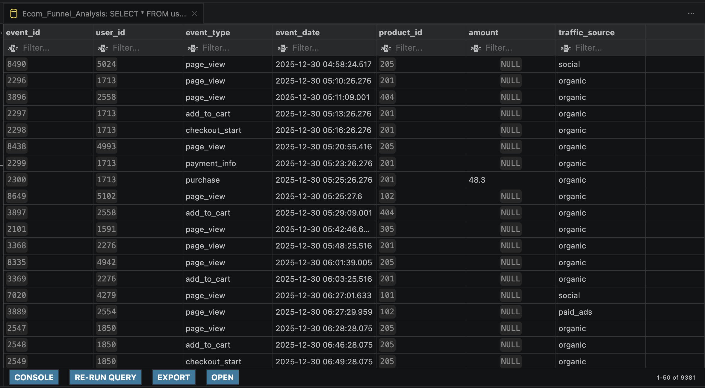
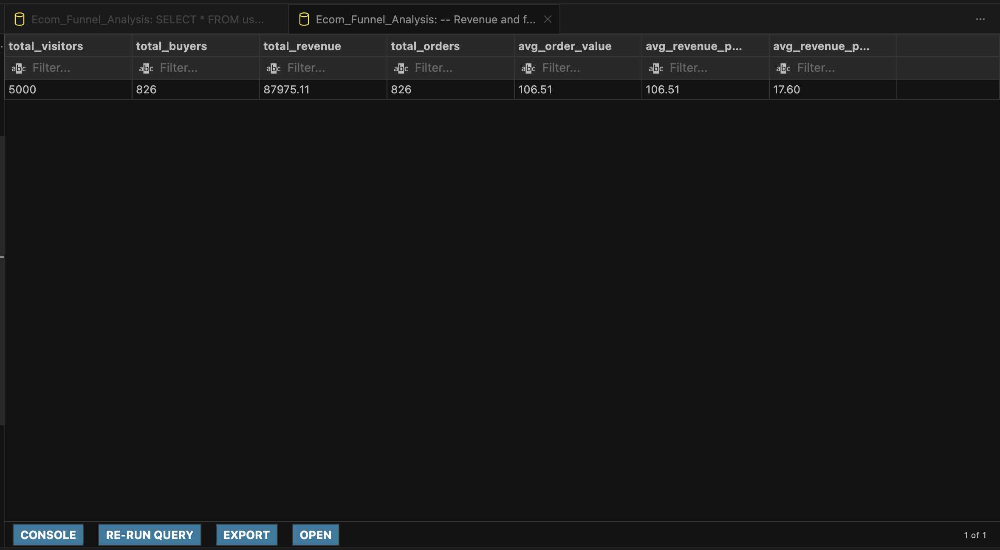

# E-Commerce Sales Funnel & Marketing Channel Optimization (SQL)

## 📌 Project Overview
This project evaluates a user performance window ($N = 5,000$ unique visitors) using an e-commerce event dataset to isolate conversion bottlenecks, evaluate marketing traffic acquisition channel efficiency, map user velocity, and establish baseline unit-economic constraints. 

The core focus of this repository is to move past writing raw SQL syntax and translate quantitative query outputs into high-impact, actionable strategic recommendations for cross-functional corporate stakeholders in **UX/Product, Growth Marketing, and Finance**.

---

## 📊 Deep-Dive Funnel Degradation Analysis

The table below breaks down absolute user volume drops and isolated stage-to-stage conversion efficiency metrics. 

### Funnel Metrics Summary
| Funnel Stage | Action Event | Absolute User Volume | Stage-to-Stage Conversion Rate | Cumulative Funnel Retention |
| :--- | :--- | :--- | :--- | :--- |
| **Stage 1** | `page_view` | 5,000 | Baseline (100.0%) | 100.0% |
| **Stage 2** | `add_to_cart` | 1,553 | **31.06%** | 31.06% |
| **Stage 3** | `checkout_start` | 1,103 | **71.02%** | 22.06% |
| **Stage 4** | `payment_info` | 899 | **81.50%** | 17.98% |
| **Stage 5** | `purchase` | 826 | **91.88%** | **16.52%** |

### Data Preview (Local Database Ingestion)
Below is the verified preview of the raw user event logs being successfully managed and queried locally within VS Code:



### Critical Funnel Observations
* **The View-to-Cart Bottleneck:** The primary leak in our business funnel resides at the initial transition point. **68.94% of all users bounce** immediately after landing on product pages without executing an item selection.
* **The Checkout Engine Health:** Conversely, our checkout architecture is highly optimized. Once a user triggers a checkout sequence, **91.88% successfully convert to a paid purchase**, indicating an exceptionally low-friction payment infrastructure.

---

## 🏁 Marketing Acquisition Channel Audit

A breakdown by acquisition source reveals a sharp divergence between high-traffic channels and high-converting intent pools.

### Traffic & Conversion Matrix
| Traffic Source | Views (Vol) | Carts | Purchases | View → Cart Rate | Cart → Purchase Rate | View → Purchase Rate |
| :--- | :--- | :--- | :--- | :--- | :--- | :--- |
| **Organic** | 2,038 | 669 | 343 | 32.83% | 51.27% | 16.83% |
| **Paid Ads** | 968 | 358 | 204 | 36.98% | 56.98% | 21.07% |
| **Email** | 522 | 326 | 177 | **62.45%** | 54.29% | **33.91%** |
| **Social** | 1,472 | 200 | 102 | **13.59%** | 51.00% | **6.93%** |

### Channel Specific Diagnostics
* **Social Media Inefficiency:** Social media is driving **29.44% of our total traffic** (1,472 views), making it a massive volume contributor. However, it displays a dismal **13.59% Cart Conversion Rate**. Users from social media are primarily shallow "window shoppers" who fail to demonstrate true commercial intent.
* **Email Marketing Super-Performance:** In contrast, Email generates the lowest traffic volume (522 views) but yields an exceptional **62.45% Cart Conversion Rate** and a **33.91% overall conversion rate**. This segment represents highly motivated, qualified return customers.

---

## ⏱️ User Velocity & Conversion Timeframes

The time elapsed between key customer interaction milestones reveals clean, highly concentrated purchasing patterns.

* **Average View to Cart:** 11.16 Minutes
* **Average Cart to Purchase:** 13.47 Minutes
* **Average Total Journey Time:** **24.63 Minutes**

**Diagnostic:** A 24-minute average checkout window indicates that conversions happen during a single active browsing session. The lack of sub-second view-to-purchase anomalies confirms the traffic is driven by legitimate human shoppers rather than malicious web bots.

---

## 💡 Strategic Cross-Functional Recommendations

Based on the quantitative insights generated via SQL, the following intentional strategic initiatives have been mapped to core executive stakeholders:

### 1. UX & Web Optimization Team (Product)
* **Insight:** The checkout funnel is remarkably frictionless, scaling from **71.02% at checkout start** to a phenomenal **91.88% at final purchase**. However, the **68.94% drop-off** from page views to cart additions represents a severe leakage of potential revenue.
* **Action:** Freeze all design or engineering sprints targeting the checkout page and payment gateways. Instead, redirect UX resources entirely toward Product Detail Pages (PDPs) and Product Listing Pages (PLPs). Implement sticky "Add to Cart" buttons, clear up information architecture, surface reviews above the fold, and test inline product recommendations to prompt immediate shopping intent.

### 2. Growth Marketing Team (Paid Acquisition)
* **Insight:** Social media campaigns are driving massive awareness volume (1,472 views) but are bleeding efficiency with an **overall purchase rate of only 6.93%**. Meanwhile, email marketing is a powerhouse, boasting a **33.91% overall purchase conversion rate** from a much smaller footprint.
* **Action:** Immediately halt direct-to-product conversion ads on social channels for top-of-funnel users. Pivot social media ad dollars toward lead-generation and email-capture campaigns (e.g., offering exclusive welcome promotions or product matching quizzes). Use social traffic to build the email distribution list first, as our data empirically proves that an email-attributed user is **nearly 5x more likely to convert to a buyer** than a standard social browser.

### 3. Finance & Operations Team (Unit Economics)
* **Insight:** The platform generated **\$87,975.11 in total revenue** across **826 orders**, defining a highly stable, uniform baseline where both **Average Order Value (AOV)** and **Average Revenue per Buyer** rest exactly at **\$106.51**. 

### Financial Revenue Terminal Verification
The following database output captures the baseline financial metrics validating these exact unit-economic ceilings:



* **Action:** Establish a strict, non-negotiable Customer Acquisition Cost (CAC) ceiling of **\$45.00** for paid channels to preserve a target contribution margin. Because social media converts at just 6.93%, any acquisition cost tracking higher than this cap creates transaction-level losses. Conversely, the high efficiency of Paid Ads (21.07% conversion) provides room to aggressively scale bidding parameters within the safe \$45.00 margin ceiling.

---

## 🛠️ Tech Stack & Directory Structure
* **Database Engine:** PostgreSQL (Local Instance)
* **Development Workspace:** VS Code, Git, & GitHub

```text
ecommerce-sales-funnel-analysis/
├── assets/                        # Embedded database verification visual captures
├── data/
│   ├── processed/                 # Placeholder for downstream dashboard schema extractions
│   └── raw/                       # Raw user_events.csv (Protected via .gitignore)
├── sql/
│   ├── 1_funnel_stages_count.sql  # User volume counts per stage
│   ├── 2_conversion_rates.sql     # Drop-off & conversion metrics
│   ├── 3_marketing_channel_funnel.sql # Traffic source performance breakdown
│   ├── 4_time_to_conversion.sql   # User velocity calculation (TIMESTAMP_DIFF)
│   └── 5_revenue_financial_metrics.sql# Financial KPIs (Revenue, Orders, AOV)
└── README.md                      # Project presentation portal